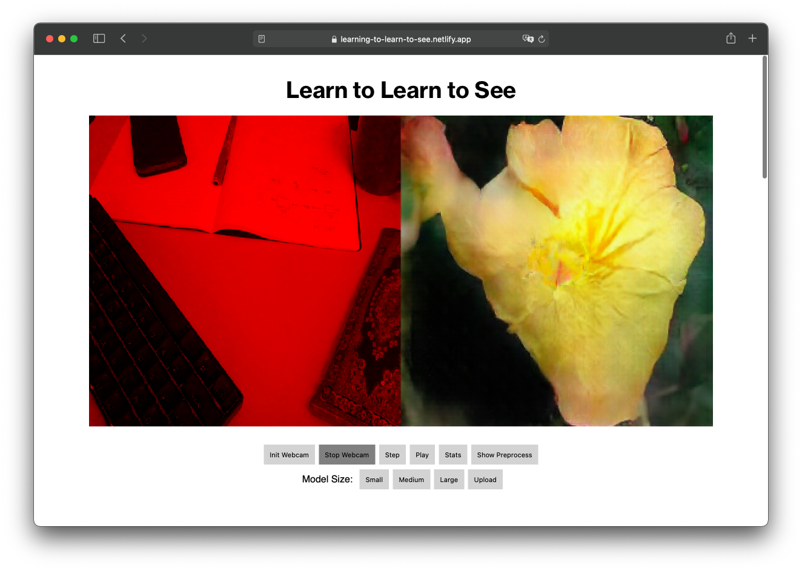

_Learning to Learn to See_ is a remake of Memo Akten's [_Learning To See_][lts] built specifically for the web, [available to use here.][app]

_Learning To See_ has become a seminal piece in the still emerging world of machine-learning driven art. When exhibited in a gallery setting, visitors are presented with a camera facing straight down and a grey tabletop with an arbitrary selection of everyday items: a phone charger, a cloth, some keys. As the visitor plays with and moves these object around, the camera feed is streamed into a [Convolutional Neural Network (CNN)][cnn] which manipulates the incoming data. The model compresses and reshapes the image data down to an abstract representation of itself, and then reforms its original structure which is projected in front of the visitor as a new image.

As a piece it both demonstrates the capabilities and limitations of a machine learning model by using a simple interaction to allow users to manipulate the images produced by the model with instant feedback. This interaction is key to its success as it immediately shows how a model takes data as input (the image from the camera feed) and transforms that data into something new (the project image).

My own experience of the artwork is something which has stuck with me and it is the most successful artworks I have had the opportunity to interact with. It helped me to understand and engage with the abstract and academic world of machine learning, so the motivation behind creating this is to get that same opportunity to even more people on their own computers at home.

Machine learning on the internet is a rich field of research as it poses many technical challenges. Typically a neural network requires great computational power to run a model of respectable size for two main reasons: a large model performs many thousands, sometimes millions of calculations on the input data to create an output; a pre-trained model itself is a collection of weights and biases which themselves take up memory on the host machine. So to create a real time interactive piece such as Learning to See the model needs to be small enough for most modern computers to be able to perform the calculations necessary and small enough to be quickly downloadable onto the users machine while holding enough information to create an interesting output.

#### Made by Josh Murr: <https://github.com/joshmurr>

[lts]: http://www.memo.tv/works/learning-to-see/
[lts_paper]: https://arxiv.org/abs/2003.00902
[app]: https://learning-to-learn-to-see.netlify.app/
[cnn]: https://cs231n.github.io/convolutional-networks/
[jm]: https//www.joshmurr.co.uk/
