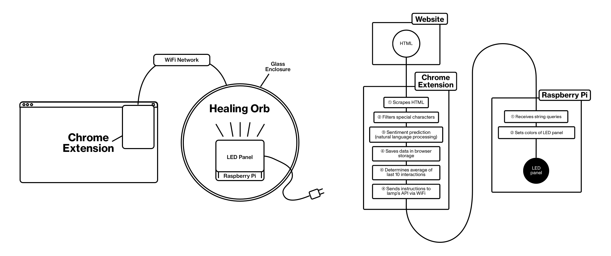
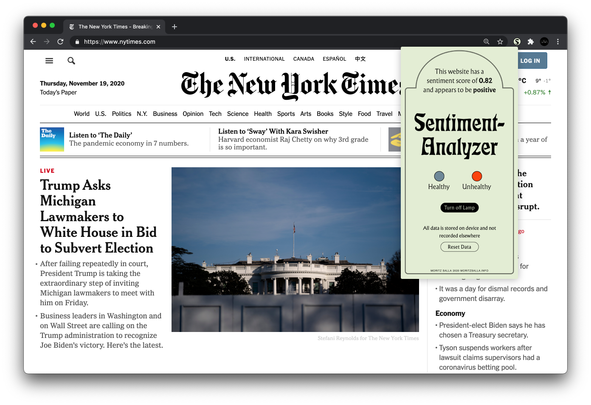

The introduction of new tools has frequently caused injury to humankind. The agricultural revolution reduced average life expectancy by 50 per cent, causing human teeth to grow crooked and fall out due to the softer, more sugary diet.

The internet is a tool. As human brains have evolved very slowly over the last 2000 years, it has been hard for us to catch up on the enormous technological advancements of the 21st century. The blisteringly fast speed of technological evolution, combined with the stigma mental health continues to have in society, makes many of tech's symptoms go unnoticed.

The tech industry's incentive to create awareness remains sluggish. The void of health solutions within the tech industry ought to be addressed and should not be left to companies that profit from the status quo.

> _Healing Orb_ is a prototype that explores how IoT can help us create digital wellbeing. By storing and analyzing the content we browse daily, it tries to judge the healthiness of our exposures.

The Healing Orb exists of two parts. **Software**, running in the background of the user's computer. A **wireless IoT device** in the form of a lamp. The latter's hue and brightness is a visualization of health levels: a specific tone represents healthy, whereas another represents unhealthy user exposure. The Orb will slowly fade its colour, dependent on an average reading, and never requires active interaction.

> By flawlessly blending into existing furniture, the Healing Orb's ambient interface provides a less obtrusive interface for self-monitoring.

As a prerequisite to using the Healing Pod, a user must install a chrome extension. This extension scrapes website content, predicts its sentiment using machine learning and sends corresponding requests to the smart lamp. The Healing Pod's smart lamp is a glass dome that contains a Raspberry Pi, running a dockerized flask server. Multiple devices of a single user can connect to it simultaneously.

> The Ambient Orb's chrome extension uses sentiment and toxicity analysis to categorize a user's content exposure

### Find the code here: https://github.com/moritzsalla/healingorb-monorepo

### By Moritz Salla: https://moritzsalla.info/
